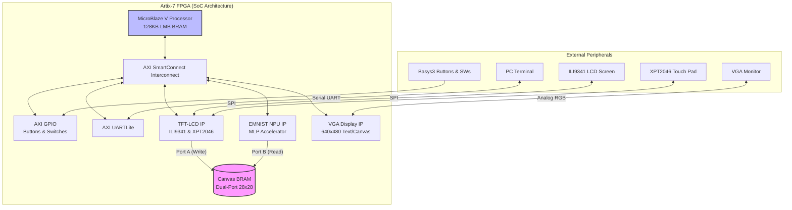

# HandCipher — SoC-Based Handwritten Letter Recognition & Caesar Cipher System Datasheet

## 1. System Overview
**HandCipher** is an integrated system-on-chip (SoC) designed on the AMD Artix-7 FPGA (Basys3 development board) that processes handwritten EMNIST letter inputs from a touchscreen, displays them on a VGA display, and performs real-time Caesar cipher encryption or decryption.

The system utilizes a **MicroBlaze V (RISC-V)** processor to control the application logic, interface with custom AXI hardware accelerators (NPU, TFT-LCD, VGA), and handle peripheral button and switch controls.

---

## 2. Technical Specifications

### 2.1 Core Parameters
*   **Target Device**: AMD Artix-7 XC7A35TCPG236-1 (Basys3)
*   **System Clock**: 100 MHz (`sys_clk_pin`)
*   **Processor Core**: MicroBlaze V (32-bit RISC-V ISA, `rv32i_zicsr_zifencei` compiler targets)
*   **Instruction & Data Memory**: 128 KB Local Memory (LMB BRAM)
*   **Host Toolchain**: Vitis Unified IDE 2024.2 / Vivado 2024.2

### 2.2 FPGA Resource Utilization (Summary)
*   **Block RAM Tile/RAMB36**: 33 / 50 (66%)
    *   *MicroBlaze local memory*: 64 × BRAM18 (32 × RAMB36)
    *   *EMNIST NPU ROMs (Weights/Bias)*: 26 × BRAM18
    *   *Shared Canvas BRAM*: 1 × BRAM18
    *   *VGA character buffer / Font ROM*: 3 × BRAM18
*   **Worst Negative Slack (WNS)**: +0.118 ns (Positive timing slack met at 100MHz)

---

## 3. AXI Address Map

The CPU communicates with custom and standard peripherals via a 32-bit AXI4-Lite bus interface.

| IP Core Component | Base Address | High Address | Description / Primary Role |
| :--- | :--- | :--- | :--- |
| **NPU IP** | `0x0002_0000` | `0x0002_0FFF` | EMNIST Neural Network Accelerator Control |
| **VGA IP** | `0x0002_1000` | `0x0002_1FFF` | VGA 640x480 Character & Canvas Buffer Control |
| **TFT-LCD IP** | `0x0003_0000` | `0x0003_0FFF` | ILI9341 Screen Drawing Canvas & XPT2046 Touch |
| **AXI GPIO** | `0x4000_0000` | `0x4000_FFFF` | Physical buttons (btnU/D/L/R) & switches (SW0/15) |
| **AXI UARTLite** | `0x4060_0000` | `0x4060_FFFF` | USB-UART Console Logging & Debugging |

---

## 4. Hardware IP Core Specifications

### 4.1 Custom EMNIST NPU IP (`npu_ip`)
Accelerates neural network inference for character recognition based on the EMNIST dataset (A–Z, 26 classes).

*   **Architecture**: MLP (Multi-Layer Perceptron) with 784 inputs (28×28 image) → 64 hidden nodes (L1) → 26 output nodes (L2).
*   **Quantization Specs**:
    *   *Input*: 8-bit unsigned integer (`uint8`, scaled 0 or 255)
    *   *Weights*: 8-bit signed integer (`int8`)
    *   *Biases*: 32-bit signed integer (`int32`)
    *   *L1 Activation*: ReLU with 10-bit right shift scaling (`>> SHIFT_L1` where `SHIFT_L1 = 10`), clamped to `[0, 255]`.
    *   *L2 Scores*: Argmax selection of 26 classes (0 = 'A', 25 = 'Z').
*   **Registers**:
    *   `0x00` (CTRL): Write `1` to start hardware inference.
    *   `0x04` (STATUS): Bit[0] = `done` (sticky, cleared on read), Bit[1] = `busy`.
    *   `0x08` (RESULT): Bits[4:0] = recognized letter index (0 to 25).
*   **Dual-Port Canvas BRAM Link**: Accesses Port B of the shared canvas BRAM (1-bit data) and converts pixel states internally to `uint8` (`0` or `255`) during NPU execution, bypassing serial memory writes from the CPU.

### 4.2 Custom TFT-LCD & Touch IP (`tft_ip`)
Manages ILI9341 LCD screen refresh rates, streams canvas coordinates, and processes analog touch data from the XPT2046 touch controller.

*   **TFT Canvas Display**: portrait mode (240×320 resolution).
    *   *Upper Area (240×240)*: 28×28 grid canvas, rendered with 8× scaling.
    *   *Lower Area (240×80)*: Two touch buttons: `OK` (green) and `CLR` (red).
*   **XPT2046 Touch Control**: Handles SPI communication, applies hardware debouncing/noise filtering, and maps raw coordinates to the 28×28 grid.
*   **Registers**:
    *   `0x00` (CTRL): Bit[0] = Enable, Bit[1] = Clear Canvas.
    *   `0x04` (TOUCH_X): Raw touchscreen X coordinate (12-bit ADC).
    *   `0x08` (TOUCH_Y): Raw touchscreen Y coordinate (12-bit ADC).
    *   `0x0C` (STATUS): Bit[0] = `touch_valid`, Bit[1] = `lcd_ready`, Bit[2] = `btn_ok` (sticky, clear-on-read), Bit[3] = `btn_clear` (sticky, clear-on-read).
    *   `0x10` (CANVAS_RD_ADDR): Address for CPU readback of canvas (0 to 783).
    *   `0x14` (CANVAS_RD_DATA): 1-bit pixel data return value (1-cycle delay).
*   **Dual-Port Canvas BRAM Link**: Port A drives writing touch pixel data directly to the BRAM (`clka`, `addra`, `dina`, `wea`, `ena`).

### 4.3 Custom VGA IP (`vga_ip`)
Generates VGA sync signals (640x480 @ 60Hz timing, 25 MHz pixel clock) and mixes a text terminal character interface with a real-time handwriting preview canvas.

*   **Character Buffer**: 40 columns × 30 rows character grid using 16×16 font characters (supporting ASCII 0 to 127).
*   **Canvas Preview Block**: Left-aligned 224×224 pixel display rendering the 28×28 hand-drawn characters dynamically.
*   **Registers**:
    *   `0x00` (CTRL): Bit[0] = Enable, Bit[1] = Clear text buffer.
    *   `0x04` (CHAR_ADDR): Write location in text buffer (0 to 1199).
    *   `0x08` (CHAR_DATA): ASCII code value of the character to write.
    *   `0x0C` (WR_STRB): Write pulse (auto-clears).
    *   `0x10` (FG_COLOR): Foreground character color (RGB444, 12-bit).
    *   `0x14` (BG_COLOR): Background background color (RGB444, 12-bit).
    *   `0x18` (CANVAS_WR_ADDR): Preview buffer write address (0 to 783).
    *   `0x1C` (CANVAS_WR_DATA): 1-bit pixel value (1 = White, 0 = Black).
    *   `0x20` (CANVAS_WR_EN): Write pulse for canvas (auto-clears).
    *   `0x24` (CANVAS_MODE): 0 = Text only mode, 1 = Preview/Composition mode.

---

## 5. Software Design & Execution Flow

### 5.1 Operating Modes
The software on the RISC-V processor switches execution based on inputs from the GPIO and Touchscreen.

1.  **Encryption Mode (`SW15 = 0`)**: Encrypts committed characters using the Caesar cipher algorithm:
    $$\text{Ciphertext} = (\text{Plaintext} - 'A' + \text{Shift}) \pmod{26} + 'A'$$
2.  **Decryption Mode (`SW15 = 1`)**: Decrypts committed characters using the reverse Caesar cipher:
    $$\text{Plaintext} = (\text{Ciphertext} - 'A' + 26 - \text{Shift}) \pmod{26} + 'A'$$
3.  **Inference Mode (`USE_SOFTWARE_NPU = 1`)**: Executes the 784 → 64 → 26 MLP network calculation in C software directly on the MicroBlaze processor. This provides a highly accurate neural model fallback, bypassing hardware NPU timing skew.

### 5.2 Dynamic Composition Loop
*   **Continuous Refresh**: The CPU reads the 784-bit canvas mirror via the `TFT_IP` readback registers and streams it pixel-by-pixel to the `VGA_IP` preview buffer using `CANVAS_WR_ADDR` / `CANVAS_WR_DATA`.
*   **Real-time Inference**: During drawing, the software dynamically runs the MLP neural inference on the current canvas state and prints the live result ("NPU Result: X") on the VGA screen.
*   **Commit & Clear**:
    *   Touching the green **`OK`** button on the TFT screen commits the current recognized character to the text buffer (`plain_buf`/`cipher_buf`), increments the buffer length, triggers recalculation, and clears the canvas to accept the next character.
    *   Touching the red **`CLR`** button on the TFT screen clears the drawing canvas and resets the live NPU prediction without committing.
*   **Global Updates**: Changing the shift amount (`btnU`/`btnD`) or the operational mode (`SW15`) triggers a full scan and recalculation of the existing message buffers, updating the VGA plaintext and ciphertext displays instantly.

---

## 6. Physical Interface & Pinout Configuration

Below is the pin constraint mapping configured in `Basys-3-Master.xdc` for system integration.

### 6.1 System Control Pins
| Pin Name | FPGA Pin | I/O Standard | Description |
| :--- | :--- | :--- | :--- |
| `clk` | `W5` | LVCMOS33 | Master System Clock (100 MHz oscillator) |
| `reset_p` | `U18` | LVCMOS33 | Center Button / Hardware Reset |
| `btnU` | `T18` | LVCMOS33 | Shift value increase (+1) |
| `btnD` | `U17` | LVCMOS33 | Shift value decrease (-1) |
| `btnL` | `W19` | LVCMOS33 | System Buffer & Canvas Clear |
| `btnR` | `T17` | LVCMOS33 | Space Character (' ') insertion |
| `sw[0]` | `V17` | LVCMOS33 | System Software Reset / Re-init |
| `sw[15]` | `R2` | LVCMOS33 | Mode Toggle (0 = Encrypt, 1 = Decrypt) |

### 6.2 VGA Display Interface
| Pin Name | FPGA Pin | I/O Standard | Description |
| :--- | :--- | :--- | :--- |
| `vgaRed[0..3]` | `G19, H19, J19, N19` | LVCMOS33 | VGA Red Color signals (4-bit DAC) |
| `vgaGreen[0..3]` | `J17, H17, G17, D17` | LVCMOS33 | VGA Green Color signals (4-bit DAC) |
| `vgaBlue[0..3]` | `N18, L18, K18, J18` | LVCMOS33 | VGA Blue Color signals (4-bit DAC) |
| `Hsync` | `P19` | LVCMOS33 | Horizontal Sync pulse |
| `Vsync` | `R19` | LVCMOS33 | Vertical Sync pulse |

### 6.3 TFT-LCD & Touch SPI Interface (PMOD JB / JC)
*   **TFT LCD Display** is connected via PMOD JB.
*   **Touch Controller** is connected via PMOD JC (sharing SPI interface).
*   **PenIrq_n** includes a hardware pull-up (`PULLUP true`) to stabilize state readouts when not touched.

| PMOD Pin | SPI Net Name | FPGA Pin | I/O Standard | Description |
| :--- | :--- | :--- | :--- | :--- |
| **JB1** | `tft_cs_n` | `A14` | LVCMOS33 | TFT LCD Chip Select (Active Low) |
| **JB2** | `tft_sdin` | `A16` | LVCMOS33 | SPI Master Out Slave In (MOSI) |
| **JB3** | `tft_sdo` | `B15` | LVCMOS33 | SPI Master In Slave Out (MISO) |
| **JB4** | `tft_sck` | `B16` | LVCMOS33 | SPI Serial Clock (Scaled to 25 MHz) |
| **JB7** | `tft_dc` | `A15` | LVCMOS33 | TFT Data/Command Select |
| **JB8** | `tft_rst_n` | `A17` | LVCMOS33 | TFT Hardware Reset (Active Low) |
| **JC1** | `touch_cs_n` | `K17` | LVCMOS33 | Touch Pad Chip Select (Active Low) |
| **JC2** | `touch_clk` | `M18` | LVCMOS33 | Touch Pad SPI Serial Clock |
| **JC3** | `touch_din` | `N17` | LVCMOS33 | Touch Pad SPI Data In |
| **JC4** | `touch_dout` | `P18` | LVCMOS33 | Touch Pad SPI Data Out |
| **JC7** | `PenIrq_n` | `M19` | LVCMOS33 | Touch Interrupt Request (Active Low, Pull-up) |

---

## 7. Performance & Noise Immunity Optimization

### 7.1 SPI Clock Scaling
To eliminate visual noise on the TFT screen caused by electrical cross-talk from high-frequency SPI transfers, the TFT SPI clock frequency is scaled down from 50 MHz to **25 MHz** inside `tft_lcd_sv.sv`. 
*   **Mechanism**: A 1-bit clock toggle divider (`spi_clk_en`) triggers FSM transitions every two clocks, resulting in clean, stable display outputs.

### 7.2 Touch Coordinate Sampling Configuration
XPT2046 Touch AD converter data collection is optimized to filter noise ripples during continuous drawing actions.

*   `CONV_TIMES = 20` (Reduced from 36 to shorten SPI burst periods).
*   `FILTER_PARAM = 3` (Discards peak maximums and minimums, performing a fast moving average shift by 8).
*   `CNT_TOP = 749999` (Generates a stable ~15 ms sampling interval at 50 MHz clock domain).
*   `PenIrq_n` is locked with the `Get_Flag` register to update coordinate latching on a single-cycle write, preventing duplicate BRAM entries.
